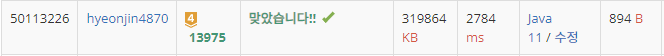

## 문제 유형
그리디, 우선순위 큐
## 결과

## 로직
- 데이터를 우선순위 큐에 넣는다(오름차순 정렬)
- 큐 사이즈가 1이 아닐때까지 2개씩 poll()하여 더하고(a+b), 전체 정답값에 더한다(sum+=(a+b))
- a+b값을 다시 우선순위 큐에 넣는다
## 리뷰
소설의 장수가 최대 1000000이고, 파일의 최대 크기는 10000이여서
자료형을 long으로 해야했었다.. int로 틀렸었다

