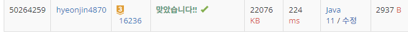

## 문제 유형
구현, BFS
## 결과

## 로직
bfs
- while문을 돌면서 아기 상어가 4방향으로 갈 수 있는 위치를 모두 큐(queue)에 넣는다
- while문에서 queue.poll()을 할 때, 아기상어의 크기보다 작은 물고기가 있는 위치를 다른 큐(fish)에 넣는다
- while문이 끝나면 우선순위가 높은 물고기(가깝고->위쪽->왼쪽) 를 리턴한다 (먹은 물고기 )
- 먹은 물고기의 위치(space) 초기화, 상어 위치 초기화, 움직인 횟수 증가, 물고기 먹은 횟수 증가 해준다.
- 위와 같은 순서를 반복한다
- 만약 물고기 먹은 개수가 현재 상어의 크기(shark_size)와 같다면 상어의 크기를 1 증가한다 또한, 상어가 먹은 물고기의 개수는 0으로 초기화 시켜준다
- 만약 bfs에서 리턴 값이 null이면 (먹은 물고기가 없으면) 종료한다.
## 리뷰
문제 자체가 이해가 잘 가지 않아서 힘들었다...
긴 문제 더더더 연습이 필요한 것 같다

