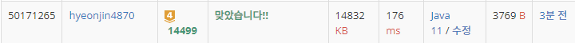

## 문제 유형
구현
## 결과

## 로직
- 지도 위의 주사위 위치를 이동한다
- 주사위가 지도 밖으로 나가면 명령 이행X
- 지도 밖으로 나가지 않으면 주사위를 굴린 후의 전개도로 재배치한다
- 지도와 주사위의 숫자도 변경한 후, 출력한다. 
## 리뷰
주사위 전개도를 돌리는 것에서 한참 헤맸다..
입체적인 것을 평면적으로 사고하는 힘을 길러야겠다

