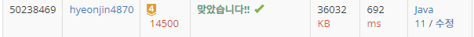

## 문제 유형
구현, DFS
## 결과

## 로직
- 상,하,좌,우로 dfs를 수행하여 depth가 4가 될때까지 반복하면 테트로미노 완성
- ㅏ ,ㅗ, ㅜ와 같은 모양은 depth가 2일때 2개의 방향으로 뻗어나가야함. 따라서 depth가 2일때 해당 위치에서 dfs를 한번 더 수행해준다.
- 해당 과정을 n*m만큼 반복한다.
## 리뷰
도저히 풀이를 모르겠어서 정답을 참고하였다. 나중에 다시 한번 풀어봐야겠다
