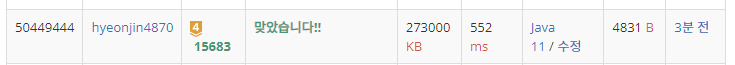

## 문제 유형
구현, DFS, 중복순열
## 결과

## 로직
- map에서 0인 부분을 노출된 영역 개수(감시 당할 영억)로 카운팅한다.
- CCTV클래스 안에 CCTV의 row,col 정보와 CCTV종류, CCTV종류에 따른 방향 개수 정보를 list에 저장한다
- 중복순열을 통해 CCTV의 방향이 정해질 경우의 수를 모두 구한다. 이때 각 depth의 for문은 CCTV의 종류에 따른 방향 개수 만큼 돈다
- 카메라의 종류와 방향에 따라 Queue를 사용하여 감시할 영역을 카운팅한다.
- 가장 많이 감시한 영역이 최소 사각지대 개수가 된다
## 리뷰
if문 조건이 까다로웠다.
중복 순열을 통해 카메라 방향 경우의 수를 구할 때, 카메라의 종류 별로 각 for문 도는 횟수를 다르게 조정하는 방법에 대해 새로 알게되었따..
