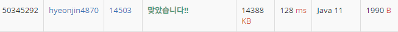

## 문제 유형
구현, DFS
## 결과

## 로직
- dfs 인자 값으로 현재 로봇의 위치와 로봇이 향하는 방향을 넣는다
- 현재 위치를 청소하고 반시계로 4방향으로 회전시킨다
- 문제에 주어진 로직대로 이행한다.
## 리뷰
50번 줄에 return을 안해줘서 한참을 헤마다가 결국 답을 봤다..
이유는 원래 dfs라면 돌아와 탐색을 안한 부분을 탐색해 줄 것이다
하지만 이 문제에서는 탐색 중에서는 되돌아와서 다시 탐색을 진행할 수 없고, 더 이상 갈 수 없어 후진할 때만 이전의 노드를 재 방문할 수 있다.
