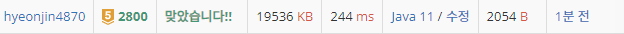

## 문제 유형
자료구조, 문자열, 스택, 재귀
## 결과

## 로직
- stack을 활용하여 올바르게 괄호를 제거할 수 있는 인덱스 쌍을 arraylist에 저장해둔다
- 재귀를 통해 제거할 수 있는 괄호쌍의 조합을 구한다.
- 구한 괄호쌍의 조합에 맞게 문자열을 수정한 후 저장하고 사전식으로 정렬한다
## 리뷰
조합 구하는거.. 여전히 헷갈린다
괄호 문제는 거의 스택을 써야한다고 생각해야할 것 같다