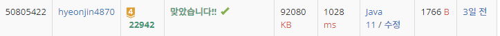

## 문제 유형
스택, 자료구조
## 결과

## 로직
- 주어진 원의 중심좌표와 반지름을 활용하여 원의 번호, x좌표, 왼쪽 x인지 오른쪽 x인 지에 대한 정보를 array에 저장한다
- x좌표 순으로 오름차순 정렬한다
- array를 처음부터 순회한다. 만약 데이터가 왼쪽 좌표이면 스택에 넣는다
- 오른쪽 좌표이면 스택 탑의 값과 현재 인덱스를 비교해서 두 개의 인덱스가 같지 않으면 두 점에서 겹치는 원이므로 "NO"를 리턴한다
  - 또한 오른쪽 좌표일때 스택이 empty 이면 "NO"를 반환한다
x 좌표가 같은 값이 있으면 두 원이 한 점에서 만나는 경우이므로 체크해준다
## 리뷰
x좌표를 구할 때 절대값을 붙여서 한참 헤맸다...