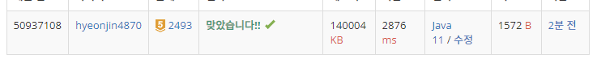

## 문제 유형
자료구조,스택
## 결과

## 로직
- 첫번째 탑은 결과를 0으로 지정하고 탑의 번호와 높이를 stack에 넣는다
- 두번째 탑부터 탐색을 진행하는데, 현재 탑의 높이가 스택 top 의 높이 보다 크면 
스택 탑의 값이 더 커질 때까지 pop()을 해준다.
  (이때 stack이 Empty면 왼쪽에 어떠한 탑도 수신을 받지 못한다는 의미이므로 결과값은 0이다)
- 현재 탑의 높이보다 스택 탑의 값이 더 크면 그 때의 스택 탑의 번호가 결과값이다.
## 리뷰
그래도 좀 스택과 친해진 것 같다