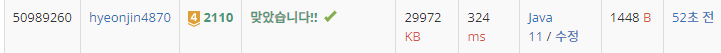

## 문제 유형
이분탐색, 매개변수 탐색
## 결과

## 로직
- 집의 위치를 오름차순 정렬한다 (이분탐색 위함)
- 집 사이의 간격을 기준으로 이분탐색을 한다(1, 가장 먼 위치) 로 시작
  - mid(중간 간격 값) 값을 구하고, 해당 mid 값을 가지고 설치할 수 있는 와이파이 개수를 구한다(count)
  - count값이 주어진 공유기 값보다 작으면 거리를 줄인다
  - count값이 주어진 공유기 값보다 크거나 같으면 거리를 늘리고, 그때의 mid값을 저장해둔다
## 리뷰
이분탐색을 어떻게 써야 할지 도저히 몰라서 답을 살짝 봤다..
count값과 주어진 공유기 값이 같은 경우에만 answer 값을 저장했는데, 
주어진 와이파이의 개수가 3개이고, 설치할 수 있는 와이파이 개수(count)가 4개인 경우에도
해당 mid 값이 정답이 될 수 있다는 점을 생각하지 못했다.
따라서 count >=C인 경우도 answer 값을 저장해 주어야 한다.