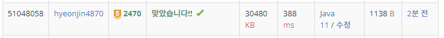

## 문제 유형
- 정렬
- 이분탐색
- 투포인터
## 결과

## 로직
- 배열을 오름차순 정렬한다
- 가장 왼쪽 용액과 가장 오른쪽 용액을 left, right로 두어서 인덱스를 좁혀 나가면서 답을 찾는다
- 현재까지의 용액 값(gap)을 저장해둔다
  - 현재 left,right에 위치하고 있는 용액의 합의 절대값이 gap보다 작거나 같으면 그 때의 gap값과 용액 값을 저장한다
  - while(left<right) 조건문을 빠져나오기 위해 현재 용액값의 합이 양수이면 right 인덱스를 줄여주고 아니면 left인덱스를 늘려준다
## 리뷰
도저히 모르겠어서 답을 봤다
알고 보니 간단한 문제였다 투포인터 잊고 있었다
이건 이분탐색은 아닌건가??
