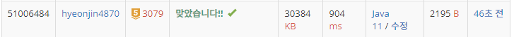

## 문제 유형
이분탐색, 매개변수 탐색
## 결과

## 로직
- 총 걸리는 시간에 대해 이분탐색을 한다
- 해당 시간에 심사대에서 심사를 받을 수 있는 사람의 총 수(count)를 구한다.
  -총시간/해당 심사대 걸리는 시간으로 구한다 !!
- count가 M(심사해야 할 총 수) 보다 작으면 범위를 늘린다
- count<=M이면 범위를 줄이고, 그때의 값을 저장한다
- 사람 수, 걸린 시간에 대해 범위가 크므로 long을 사용한다
## 리뷰
범위가 크면 이분탐색을 의심해봐야겠다
시간을 좀 더 줄이는 방법을 생각해야겠다