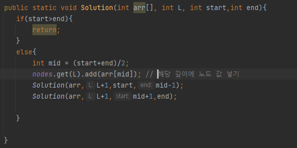

## 문제 유형
- 트리
- 재귀

## 코드

## 로직
1. 입력 값에서 나열된 수의 중간 값이 해달 레벨에서의 루트 노드이다.
2. 중간 값을 기준으로 왼쪽, 오른쪽 배열을 서브트리라 생각하면 각 서브트리의 중간 값이 해당 레벨에서의 루트 노드이다.

--> 재귀 함수를 돌면서 중간 값과 그때의 레벨을 함께 저장해 놓고 출력한다.

## 리뷰

레벨을 함께 저장한다는 생각을 쉽게 떠올리지 못했다.