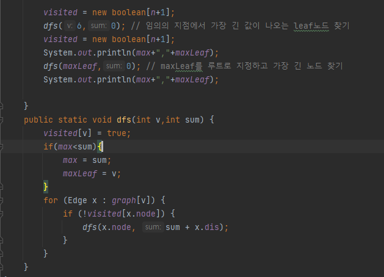

## 문제 유형
- 트리
- 재귀

## 코드

## 로직
1. 임의의 노드에서 dfs를 통해 가장 cost가 많이 나오는 maxleaf를 찾는다
2. max노드에서 또 dfs를 돌아서 기존의 cost보다 비용이 더 많이 나오면 max값을 업데이트 한다

## 리뷰

못풀었다..
임의의 노드에서 dfs를 한 번 돌았을 때 cost가 가장 많이 나오는 지점이 원의 지름이라는 것을 생각해내지 못했다.

