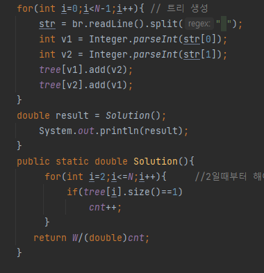

## 문제 유형
- 그래프

## 코드

## 로직

1. 일단 더 이상 물이 움직이지 않는 상태는 모든 물이 leaf 노드에 도달한 상태이다
2. 노드들 중 기댓값이 0보다 큰 정점들의 개수는 leaf 노드의 개수왇 동일하다.

--> leaf노드의 갯수를 구해서 전체 W에서 나누면 된다.

## 리뷰

처음에는 ArrayList의 리스트에 값을 다 넣어놓고, 각 인덱스에서의 ArrayList 갯수 파악해서 값을 나누고 Queue이용하고.. 난리났었다 
근데 어짜피 나누어질 전체 물 양은 똑같았고 leaf노드 값도 변치 않았다  
root 노드에서 자식이 하나일 경우에는 root노드 leaf값으로 카운팅 되는데 이걸 캐치하지 못해서 시간 많이 잡아먹었다.