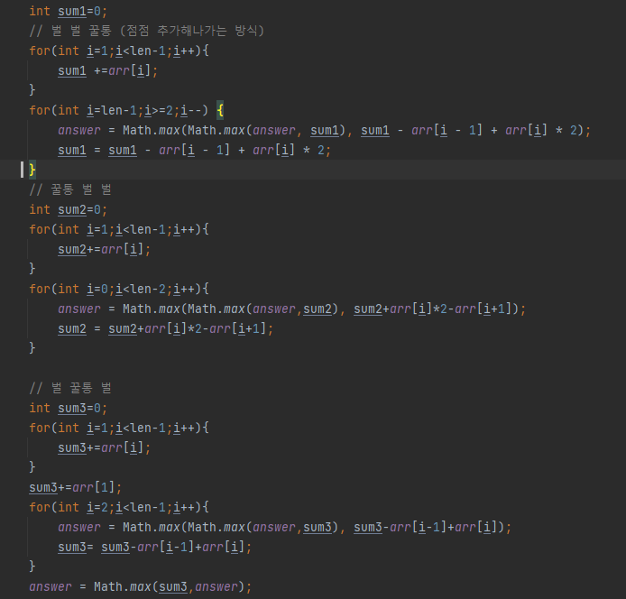

## 문제 유형
- 그리디
- 누적 합
- 많은 조건 분기

## 코드

## 로직
- 벌 벌 꿀통 / 꿀통 벌 벌 / 벌 꿀통 벌 3가지 조건으로 나누어서 푼다.
- 각 각 조건에서 벌이 꿀을 먹을 수 있는 최대값을 구한다.
## 리뷰

시간 엄청 오래걸렸다.
for문 돌면서 그때그때 값을 저장해두어서 최대값을 구했는데
배열에 누적합을 저장해두는 방식으로 풀어야하는 것이였다.

