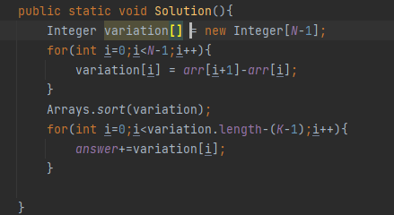

## 문제 유형
- 그리디
- 정렬

## 코드

## 로직
- 배열 간의 변화량을 저장해 놓는다
- 변화량 배열을 정렬한다.
- K개의 구간으로 나눠야하므로 K-1번 자르면 되는데 변화량이 큰 부분을 자르면 된다.
- 따라서 변화량 배열에서 K-1개 만큼을 큰 순으로 날리면 된다.
## 리뷰
그냥 문제보고 무작정 N-1CK-1 조합으로 풀었는데 자꾸 시간초과가 났다. DFS+for문 때문인 것 같다
변화량을 배열에 저장해두면 쉽게 풀리는 문제였다.. 생각좀 하고 문제 풀어야겠다...

