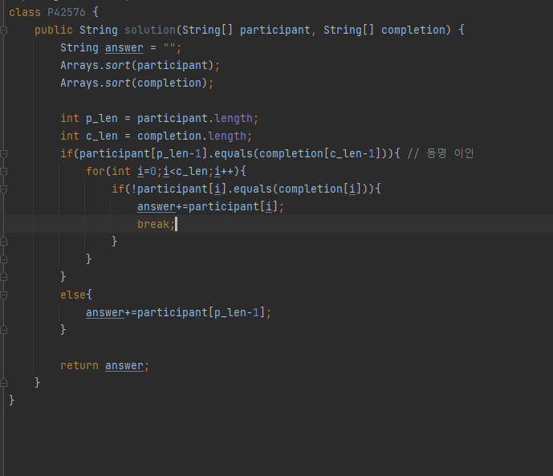

## 문제 유형
-해시
## 코드

## 로직
- participant와 completion을 알파벳 순서로 정렬한다
- 동명이인이 없다면
    - participant와 completion은 한 명 차이나므로 participant의 마지막 선수가 완주하지 못한 선수 이다.
- 동명이인이 있다면
    - for문을 돌면서 participant와 completion의 같은 인덱스 에서 문자열 다를때 그때의 participant가 완주하지 못한 선수이다.
  
## 리뷰
뭔가 허무한 문제다..

