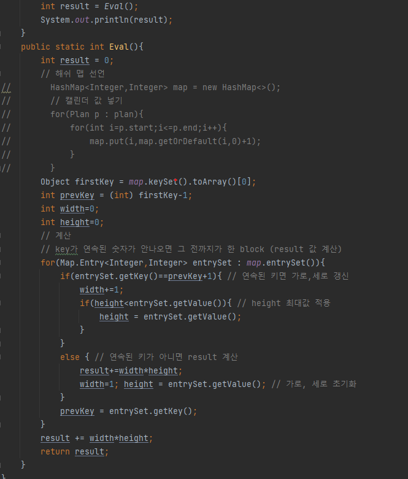

## 문제 유형
-구현, 그리디 알고리즘, 정렬
## 코드

## 로직
- 시작 날짜와 종료 날짜를 Plan(class) 객체 배열에 담는다
- 1.시작 날짜 순으로 오름차순 2.기간 순으로 내림차순 정렬한다
- Plan 객체 갯수만큼 돌면서 시작부터 종료 날짜 까지 hashMap에 값을 넣어준다 key:날짜, value : +1
- 해쉬맵의 value가 0이 나오는 시점에서 한 block을 계산해준다.
## 리뷰
- 처음에 Plan 객체 무작정 정렬했는데 안해도 되는 것이였다..
- 배열 쓴 방법이랑 for문 비슷하게 도는 것 같은데 왤케 시간이 오래 걸리는지 모르겠다.. 뭐지..?

