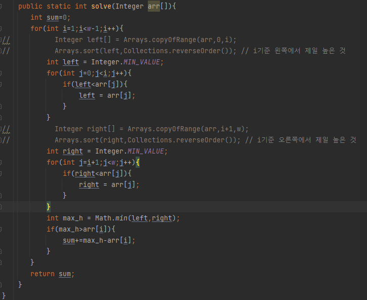

## 문제 유형
- 구현, 시뮬레이션
## 코드

## 로직
- 인덱스 1부터 w-1까지 돌면서 빗물이 고인 양을 측정한다
- 각 인덱스의 왼쪽에서 가장 높은 높이, 오른쪽에서 가장 높이를 구해서 그 중 낮은 높이(max_h)를 구한다.
- max_h에서 본인의 높이를 빼면 물이 고인 양이다
## 리뷰
- 처음에 웅덩이 가장 왼쪽보다 현재 값이 크거나 같거나, 왼쪽 기둥이 정해지고 이전 보다 높이가 작아지는 시점에서
물의 양을 구하는 방법으로 문제를 풀었는데 테스트케이스는 다 맞는데 정답이 아니였다.. 왜그런지 모르겠다..
- 결국 답을 참고하여 현재 인덱스를 기준으로 왼쪽,오른쪽 높이를 찾아 물의 높이를 구하는 더 좋은 방법을 알게되었다... 
- 그리고 copyOfRange를 써서 코드를 단순하게 하는 것 보다 시간복잡도를 더 신경써야겠다.

