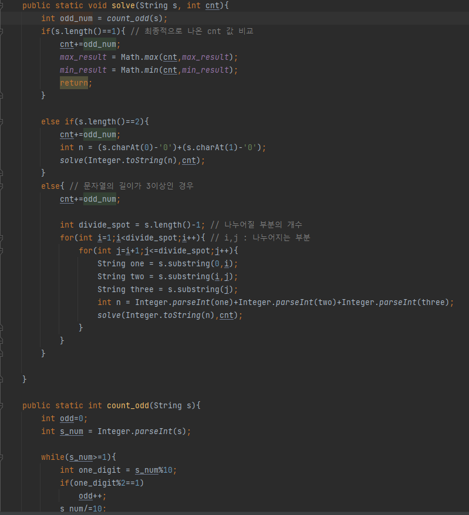

## 문제 유형
-구현, 브루트포스알고리즘, 재귀
## 코드

## 로직
- 문자열의 개수가 1인경우 --> 종료조건 및 최대,최소 값 갱신
- 문자열의 개수가 2인경우 --> 절반을 기준으로 두 부분으로 나눈다
- 문자열의 개수가 3인경우 --> 나눌 수 있는 모든 경우의 수를 고려해서 재귀를 사용한다
## 리뷰
경우의 수를 모두 고려해야 하는 경우는 재귀를 많이 쓰는 것 같다..

