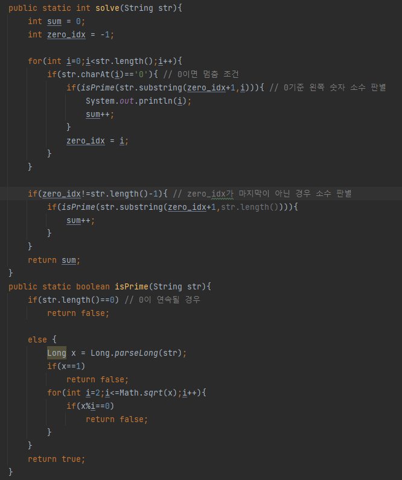

## 문제 유형
카카오 블라인드 채용
## 코드

## 로직
- 0이나오면 멈추고 왼쪽 숫자의 소수를 판별하고, zero_idx를 갱신한다
- zero_idx가 마지막 인덱스가 아니면 zero_idx부터 마지막 인덱스까지의 정수의 소수를 판별한다.
## 리뷰
소수를 판별할 때 2부터 본인 숫자까지 다 나눠서 판별하니까 시간 초과가 났다.
가운데 약수를 기준으로 등식이 대칭적인 형태를 보인다는 점을 이용하여 제곱근의 약수까지만 나누어떨어지는지 확인하여 시간 초과 문제를 해결할 수 있었다.

