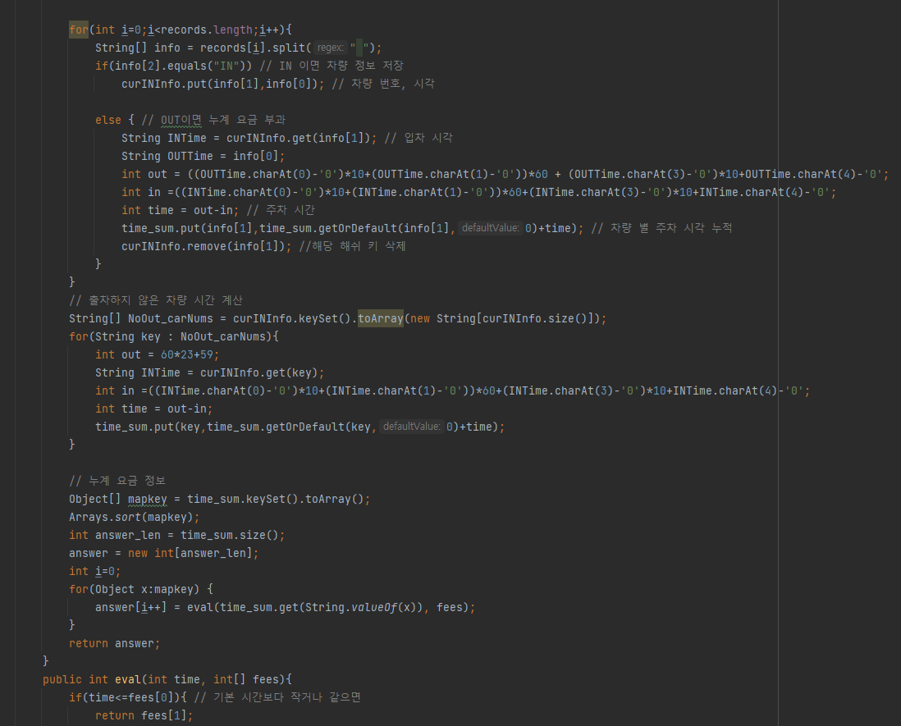

## 문제 유형
-카카오 블라인드 채용

## 코드

## 로직
- 현재 주차된 차량 정보를 저장한 해쉬맵(1), 차량 별 누계 시간을 저장한 해쉬 맵(2) 선언
- IN 이면 (1)저장 
- OUT 이면 (1)삭제, (2)저장
- 출차하지 않은 차량 계산
- 요금 계산

## 리뷰
- 구현 문제는 차근차근 하는게 중요한 것 같다.
- Math.ceil 함수 쓸때 나눗셈을 하면 자동으로 내림이 된다는 사실을 간과해서 헤맸다. 
- Math.ceil 을 쓸 때는 꼭(double)을 적용해 주어야 함을 기억해야겠다.

