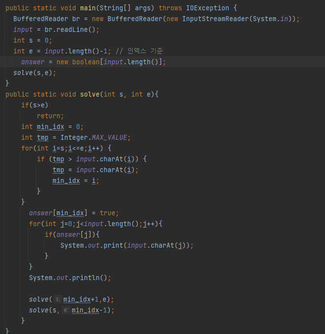

## 문제 유형
`- 구현, 문자열, 재귀
## 코드

## 로직
- 특정 범위 내에서 사전 순으로 가장 빠른 문자를 채택하고 해당 문자의 오른쪽과 왼쪽 부분을 나눈다.
- 해당 문자의 오른쪽 부분을 먼저 위의 로직을 재귀적으로 반복한다.
- 채택된 문자는 매 재귀마다 출력해준다.

## 리뷰
반복문을 통해 가장 작은 문자를 찾는 방식을 사용하지 않고
정렬을 하는 방법을 택하여서 반복된 문자에 대한 예외가 발생해서 많이 헤맸다...

