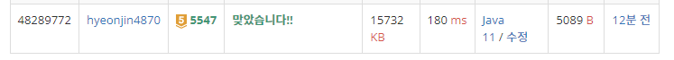

## 문제 유형
그래프 이론, 그래프 탐색, 너비 우선 탐색, 깊이 우선 탐색
## 결과

## 로직
- 만약 1이면 BFS로 1(벽)을 따라가면서 외벽의 합을 모두 구한다.
- 만약 0이면 BFS로 접근 후, 1과 접해있는 부분을 카운팅한다.
  - 해당 좌표에서 외벽과 접해있으면 내벽이 아닌 것으로 판단한다.
  - queue가 빌때까지 외벽과 접해있는 곳이 없으면 내벽으로 판단되어 외벽의 합에서 빼준다. 
## 리뷰
코드가 너무 길어지면서 이상함을 감지하였지만 멈출 수가 없었다..
풀이를 보니까 먼저 0좌표를 BFS로 따라간 다음에 내벽인지를 판단하고 벽의 길이를 측정하는 방법을 썼다..
훨씬 효율적인 것 같다. 문제 풀이할 때 좀더 효율적인 방법을 신중하게 고민해봐야겠다....

