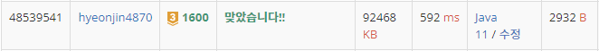

## 문제 유형
그래프 이론, 그래프 탐색, 너비우선 탐색
## 결과

## 로직
- BFS 탐색으로 원숭이 방법으로 갈 수있는 경우의 수, 말 방법으로 갈 수 있는 경우의 수를 큐에 넣는다.
- 말 방법으로 가는 방법을 몇 번 사용하였는지에 따라 visited 배열을 따로 두어 중복 체크를 하기 위해 visited 배열을 3차원으로 선언한다
- 각각의 말 객체는 이동 횟수, 말 방법 사용 횟수, 좌표를 두어 큐에 넣는다.
    - 이를 이용하여 말로 이동하는 방법 사용을 K번 쓴 객체는 말로 가는 방법의 경우의 수를 기각한다.
## 리뷰
도저히 모르겠어서 답을 참고하였는데 visited 3차원 배열 아이디어 천재인것같다
더 노력해야겠다..
