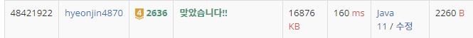

## 문제 유형
구현, 그래프이론, 그래프 탐색, 너비 우선 탐색, 시뮬레이션
## 결과

## 로직
- 0을 기준으로 BFS 탐색을 진행한다.
- 0을 기준에서 탐색 과정에서 접해있는 1이 내부가 아니라 바깥에 있는 치즈이다.
- 가장 한번 phase에서 사라진 바깥 치즈는 음수로 지정한다. 
## 리뷰
BFS문제를 많이 접했지만 할 때마다 자잘한 실수를 많이 하는 것 같다 보완해야겠다.

